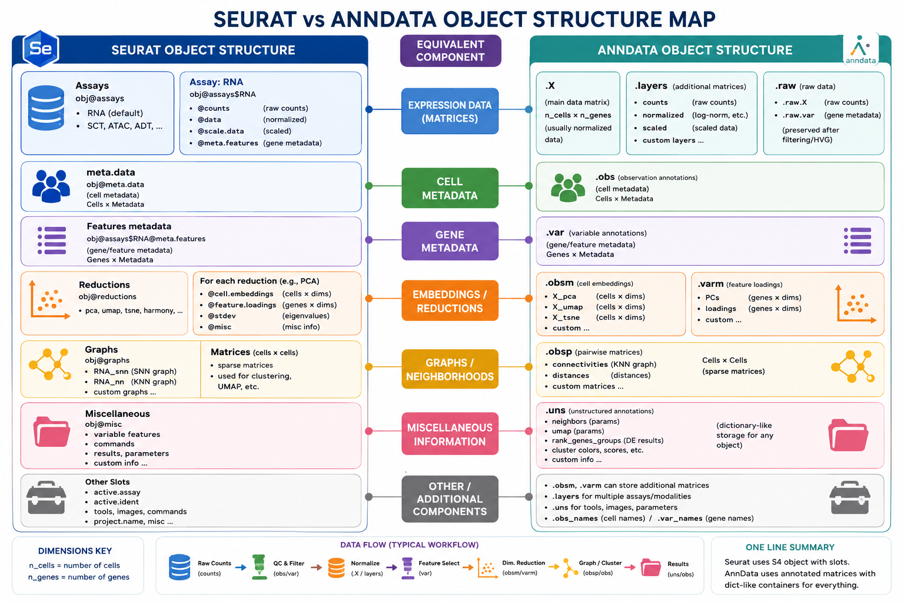

# Quick_Anndata_Explorer (Forked & Enhanced)

- This is the forked version of the **[Quick_Anndata_Explorer](https://github.com/GeneticCodon/Quick_Anndata_Explorer/tree/main)** repository
- Several modifications have been made to improve usability, especially for researchers who frequently switch between **Seurat (R)** and **Scanpy (Python)**

## Modifications / Additions

1. **Quality Control (QC) metrics** – Automatically computed to give you insight into how the data was filtered/analyzed, even when exploring already processed datasets.
2. **Split by sample** – If the uploaded data is merged (e.g., multiple samples/batches), you can now **split and visualize each sample separately** – previously no "split by" option existed.
3. **Save plots** – You can now export generated plots directly from the interface.
4. **Memory optimization** – The tool now handles larger datasets more efficiently, reducing memory overhead during exploration.
5. **Increased upload file size** – Streamlit’s default upload limit is `200 MB`. Follow the instructions below to increase it for large datasets.

---

> **Note**
>
> The original repository credit goes to the authors of **[Quick_Anndata_Explorer](https://github.com/GeneticCodon/Quick_Anndata_Explorer/tree/main)**
>
> This fork only adds quality-of-life improvements
>
> For installation, usage, and other instructions, please see the original repository **[here](https://github.com/GeneticCodon/Quick_Anndata_Explorer/tree/main)**

**Increasing File Upload Size (for large datasets)**

To upload larger `AnnData` objects (e.g., >200 MB), run this:

```bash
streamlit run app.py --server.maxUploadSize=2042  # size in MB (e.g., 5024 = 5 GB)
```

---

## WHY THIS TOOL?

- This tool is extremely handy for those who work heavily with Seurat (like me) but occasionally need to explore already analyzed scRNA-seq datasets available in `.h5ad` format
- So before wasting time in converting `.h5ad` into `Seurat` object, explore the data with this tool and see if it is good enough and have appropriate metadata according to your needs
- It bridges the gap by providing a familiar, interactive interface while respecting the `AnnData` structure
- Because even experienced Seurat users (like me :)) ) frequently forget how `AnnData` is organized, below is a quick comparison map to help you translate between the two

---



> More modifications are welcome! Feel free to contribute – especially spatial‑data‑specific QC metrics (e.g., spot purity, tissue coverage, or neighbor‐based stats)

---
